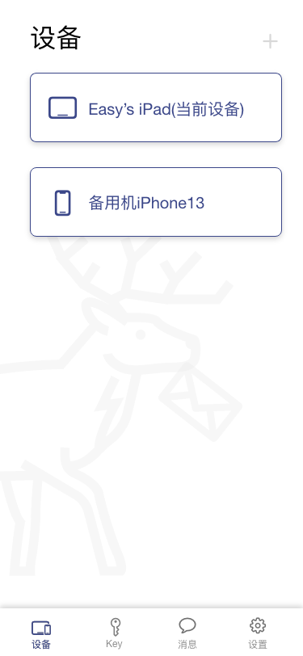
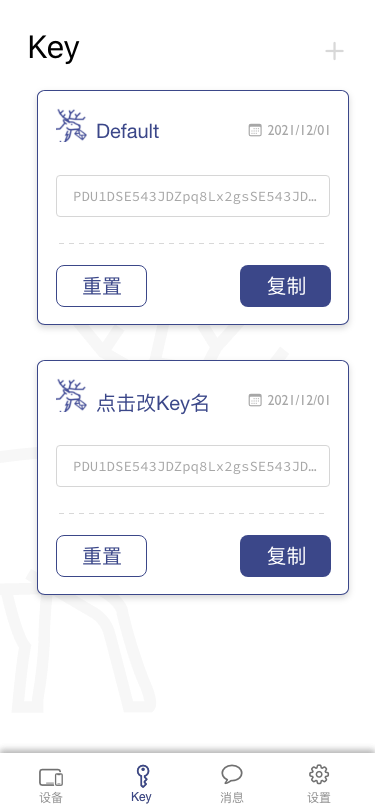
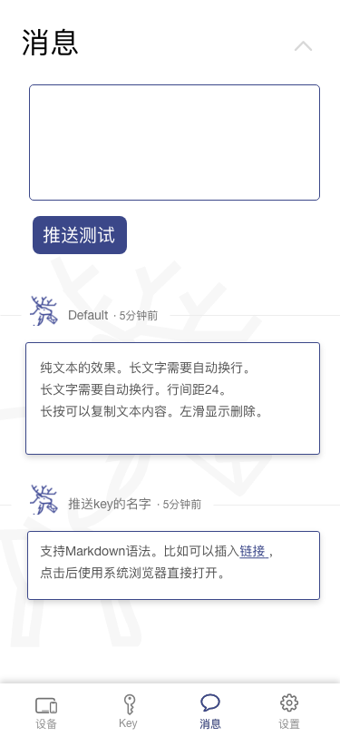
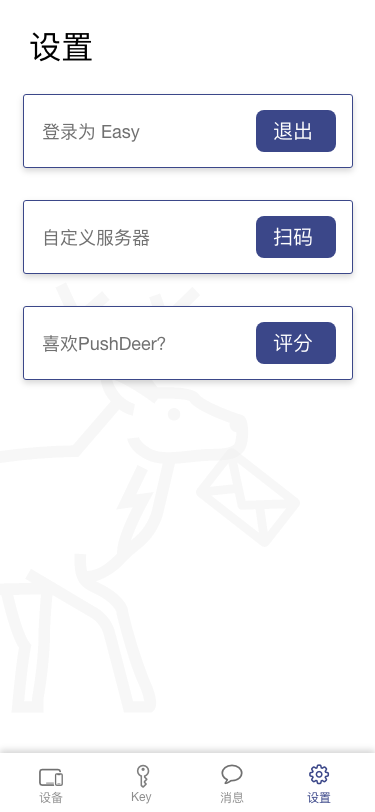

# PushDeer

PushDeer开源版，可以自行架设的无APP推送服务（WIP，API、iOS、Android和Mac第一版本完成，轻应用正在施工🚧）

[🐙🐱 GitHub仓库](https://github.com/easychen/pushdeer) [🔮 中国大陆镜像仓库](https://gitee.com/easychen/pushdeer)

|登入|设备|Key|消息|设置|
|-|-|-|-|-|
|||||

[📼 无App推送使用演示视频](https://weibo.com/tv/show/1034:4714616840978534?from=old_pc_videoshow) [📼 项目视频说明](https://www.bilibili.com/video/BV1Ar4y1S7em/) [📼 项目架构和模块说明](https://www.bilibili.com/video/BV1ZS4y1T7Bf/)


## 一期功能核心贡献者

|功能|核心贡献人|预期完成时间|最低版本兼容|本周进度|
|-|-|-|-|-|
|iOS/MacApp+Clip开发|[Hext123](https://github.com/Hext123)|已完成|iOS15（14兼容修复中）|第一版完成，代码在iOS目录下|
|Android客户端|[WolfHugo](https://github.com/alone-wolf)|已完成|5.1|第一版开发完成，release页面可下载|
|快应用|[7YHong](https://github.com/7YHong)|2022年2月27日|-|完成快应用界面展示部分，下周对接API|
|API完善和更新|[古俊杰](https://github.com/ilovintit)|配合客户端同步更新|-|添加自动生成swgger文档功能中|

## 试用

使用方法：


1. 苹果系统（iOS 15+）用摄像头扫描上边的码（ Android快应用未上架，可从右侧Release处下载APP用 ）
1. 通过apple账号登录
1. 切换到「设备」标签页，点击右上角的加号，注册当前设备
1. 切换到「Key」标签页，点击右上角的加号，创建一个Key
1. 通过访问后边的URL即可推送内容：https://api2.pushdeer.com/message/push?pushkey=key&text=要发送的内容

iOS APP和Mac APP可以在苹果商店搜索安装。注意iOS APP、Mac APP和轻应用都被认为是不同的设备，都需要进行注册才能接收推送。

PS：系统设计最低支持版本为iOS14，但目前存在兼容性问题，有iOS14真机和苹果开发者证书的同学可以下载源码并编译（参考[这个文档](ios/PushDeer-iOS/README.md)），将报错信息提交到issue可以加速我们的修复时间。

## 将 PushDeer 接入 ServerChan 

由于 PushDeer 刚开发，很多软件和平台都尚未整合其接口，你可以将 PushDeer 接入Server酱作为通道使用，效果是：

1. 调用Server酱接口
2. 在 PushDeer 客户端收到通知

方式如下：

1. 登入 sct.ftqq.com ，选择「消息通道」页面，选择「其他通道」中的「自定义」
2. 在「自定义 WebHook 配置用 json」中填入以下内容:

```json
{
	"url":"https://api2.pushdeer.com/message/push?pushkey={{pushkey}}",
	"values":[
		{"type":"markdown"},
                 {"text":"{{title}} "},
                 {"desp":"{{url}}"}
	]
}
```

注意将 `{{pushkey}}` 换成你自己的 PushDeer 账号中的 key，保存即可。可点右侧的测试按钮测试效果。

## FAQ

> 这个程序有什么用？

请参考本页面应用场景一节。

> 应用闪退怎么办？

iOS14 闪退问题正在定位，可参照上一段文字帮我们加快修复进度。

> 推送可以支持Mark和图片吗？

支持，请参考本页API说明一节中 message 部分.

> PushDeer 提供推送证书吗？

出于内容和安全考虑，官方APP不提供推送证书。待功能稳定后，我们会单独发布一个自架版APP/Clip并提供独立的推送证书，以免因为证书被滥用而影响到普通用户的使用。

> 轻APP找不到了怎么办？

在搜索框搜索pushdeer就能找到。

> 轻应用怎么清理掉?占空间么?

系统设置里边有一个轻应用管理，在里边可以清理。30天不用会自动清理掉。注意重新安装后设备id会变动，需要再手动注册一遍。

> 推送返回 code 0 result false ，但收不到推送

需要先注册当前设备。

> URL推送的文字如何换行?

URL中可以使用`%0A`作为换行符，如 `https://api2.pushdeer.com/message/push?pushkey=key&text=line1%0Aline2`

## 安装文档

- 𐂂 [点此查看](doc/安装文档.md)


## 相关项目

- [Android客户端临时仓库](https://github.com/alone-wolf/pushdeer_for_android)
- [API的Go实现](https://github.com/iepngs/pushdeer-backend-go) by [iepngs](https://github.com/iepngs)
- [Go SDK](https://github.com/Luoxin/go-pushdeer-sdk) by [Luoxin](https://github.com/Luoxin)


## 产品定义

PushDeer的**核心价值**，包括：「易用」、「可控」和「渐进」。

### 易用

易用性表现在两个方面：

1. 易安装：采用无APP方案，直接**去掉安装步骤**
1. 易调用：只需输入URL，**无需阅读文档**，就可以发送消息

### 可控

1. `Self-hosted`：让有能力和精力的用户可以自行架设，避免因为在线服务下线导致的接口更换风险。
1. 非商用免费：不用PushDeer挣钱，就无需支付费用
1. 不依赖微信消息接口：不像Server酱那样受腾讯政策影响

### 渐进

1. 通过URL即可发送基本的文本消息；通过更多参数，可以对消息的样式等细节进行调整
1. 无APP不能实现的功能不能覆盖的机型，后期可以通过APP来补充

## 商业模式

PushDeer是一个商业开源项目，采用「开放源码」、「自用免费」、「在线服务收费」的方式进行运作。

### 具体实现

PushDeer是一个以盈利为目的的商业项目，品牌和源码所有权都由「方糖君」公司持有，但和纯商业项目不同的地方在于：

1. 它开放源代码，所有人都可以在非商业前提下按GPLv2授权使用
1. 它接受社区贡献代码，作为回报，它会从商业收益中拿出部分来赞助项目贡献人
1. 如果商业收益够大，它会尝试雇佣项目贡献人以兼职或者全职的方式为项目工作

这里边有一些细节：

1. 为了避免某些个人或者公司使用源码搭建在线竞品服务收费，我们限制了源码不能商用
1. 在刚开始的时候，项目并没有商业收入，而却是开发工作量最大的。所以首先我们会承担产品和界面设计、API设计和开发等工作；并通过众筹的方式筹集了一些资金给其他大模块的贡献人

开放源码形式保证了其他代码贡献人在非商业场景下对源码的可控：

1. 如果社区和代码贡献人不满意「方糖君」主导的商业化，可以 Fork 一个版本，继续在非商用的前提下自行运营
1. 如果「方糖君」之后不再开放源代码，普通用户依然可以按之前的协议使用修改协议前的源码

## 用户细分

PushDeer主要面向以下三类用户

1. 高阶电脑用户
1. 开发者
1. 公司或自媒体

### 高阶电脑用户

具有一定电脑操作技能的高阶用户，比如：

1. NAS 用户
1. 站长
1. 电脑技术爱好者

他们使用PushDeer的场景包括但不限于：

1. 推送路由器和 NAS 的状态、公网 IP 等信息
1. 推送 Wordpress 最新的评论
1. 推送加密货币达到特定价格的通知
1. 在多台设备上推送文本
1. 自动化工具推送定期汇报

### 开发者

使用PushDeer的场景包括但不限于：

1. 推送报错和调试信息
1. 推送服务器异常
1. 推送定时任务输出
1. 在自己的软件发送消息到手机（引导用户填入PushDeer的key）

### 公司或自媒体

使用PushDeer的场景包括但不限于：

1. 面向自己的用户推送通知、内容和营销信息（类似公众号，但不受微信限制）

## 项目目录说明

- api: Laravel实现的API接口，[点此查看请求和返回demo](doc/api/PushDeerOS.md)
- docker: API实现的docker封装，一键启动，方便使用
- doc: 文档目录，包括界面设计源文件（Adobe XD）和资源文件（logo和avatar）
- push: 基于 [gorush](https://github.com/appleboy/gorush) 架设的推送微服务，配置文件开启 async 可以提升发送速度
- ios: 用于放置 iOS 源文件，`ios/Prototype_version` 目录是我边学边写的原型验证版本（SwiftUI+Moya+Codable），很多地方需要重写，仅供参考
- quickapp: 用于放置快应用源代码

## 开发环境搭建

### 下载代码

```git clone https://github.com/easychen/pushdeer.git```

### 配置推送证书

进入 `push` 目录，修改 `*.yml.sample` 为 `*.yml`。其中iOS应用和Clip使用两个分开的证书进行推送，`ios.yml` 是APP的配置、`clip.yml`是Clip的配置。注意根据开发和产品状态，修改`yml`中的值`production`。

默认配置中，`c.p12` 是APP的推送证书、`cc.p12`是Clip的推送证书。

### 启动docker环境

运行 `docker-compose up -d`，启动API。默认访问地址为`http://127.0.0.1:8800`。可修改`docker-compose.yml`调整端口。

### API 说明

[在线文档（Swagger）](https://ilovintit.github.io/pushdeer-api-doc/#/) 

API_BASE=http://127.0.0.1:8800

认证方式：通过登入接口获得`token`，通过`post`和`get`方式附带`token`参数即可自动登入。

#### 模拟登入(环境变量APP_DEBUG=true时可用)

`GET /login/fake`

#### 通过苹果 idToken 登入

`POST /login/idtoken`

|参数|说明|备注|
|-|-|-|
|idToken|Sign in with Apple 中得到的 idToken|

#### 通过微信 oauth code 登入

`POST /login/wecode`

|参数|说明|备注|
|-|-|-|
|code|客户端微信授权得到的code|


#### 合并用户并将旧用户删除

`POST /user/merge`

|参数|说明|备注|
|-|-|-|
|token|认证token|
|type|字符串，必须为 apple 或者 wechat|
|tokenorcode|type 为 apple时此字段为 idToken，否则为 微信code |

#### 获得当前用户的基本信息

`POST /user/info`

|参数|说明|备注|
|-|-|-|
|token|认证token|

#### 注册设备

`POST /device/reg`

|参数|说明|备注|
|-|-|-|
|token|认证token|
|name|设备名称|
|device_id|device token（推送用）|
|is_clip|是否轻应用|0为APP|

#### 设备列表

`POST /device/list`

|参数|说明|备注|
|-|-|-|
|token|认证token|

#### 重命名设备

`POST /device/rename`

|参数|说明|备注|
|-|-|-|
|token|认证token|
|id|设备id|
|name|设备新名称|

#### 移除设备

`POST /device/remove`

|参数|说明|备注|
|-|-|-|
|token|认证token|
|id|设备id|

#### 生成一个新Key

`POST /key/gen`

|参数|说明|备注|
|-|-|-|
|token|认证token|

#### 重命名Key

`POST /key/rename`

|参数|说明|备注|
|-|-|-|
|token|认证token|
|id|Key ID|
|name|Key新名称|

#### 重置一个Key

`POST /key/regen`

|参数|说明|备注|
|-|-|-|
|token|认证token|
|id|Key ID|

#### 获取当前用户的Key列表

`POST /key/list`

|参数|说明|备注|
|-|-|-|
|token|认证token|

#### 删除Key

`POST /key/remove`

|参数|说明|备注|
|-|-|-|
|token|认证token|
|id|Key ID|


#### 推送消息

`POST /message/push`

|参数|说明|备注|
|-|-|-|
|pushkey|PushKey|
|text|推送消息内容|
|desp|消息内容第二部分，选填|
|type|格式，选填|文本=text，markdown，图片=image，默认为markdown|

#### 获得当前用户的消息列表

`POST /message/list`


|参数|说明|备注|
|-|-|-|
|token|认证token|
|limit|消息条数|默认为10，最大100

#### 删除消息

`POST /message/remove`

|参数|说明|备注|
|-|-|-|
|token|认证token|
|id|消息ID|


[更详细的请求和返回值可以参考这里](doc/api/PushDeerOS.md)

通用返回格式：

```
{
    code:正确为0，错误为非0,
    content:内容,错误时无此字段，
    error:错误信息，无错误时无此字段
}
```
## 授权

本项目禁止商用（包括但不限于搭建后挂广告或售卖会员、打包后上架商店销售等），对非商业用途采用 GPLV2 授权


